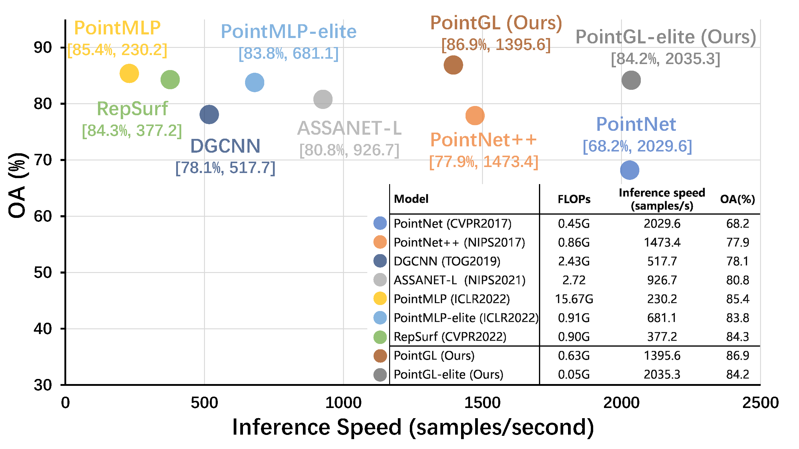

# PointGL: A Simple Global-Local Framework for Efficient Point Cloud Analysis [TMM 2024]
Official implementation of [PointGL: A Simple Global-Local Framework for Efficient Point Cloud Analysis].

The paper has been accepted by **TMM**.

## Introduction
Efficient analysis of point clouds holds paramount significance in real-world 3D applications. Currently, prevailing point-based models adhere to the PointNet++ methodology, which involves embedding and abstracting point features within a sequence of spatially overlapping local point sets, resulting in noticeable computational redundancy. Drawing inspiration from the streamlined paradigm of pixel embedding followed by regional pooling in Convolutional Neural Networks (CNNs), we introduce a novel, uncomplicated yet potent architecture known as PointGL, crafted to facilitate efficient point cloud analysis. PointGL employs a hierarchical process of feature acquisition through two recursive steps. First, the Global Point Embedding leverages straightforward residual Multilayer Perceptrons (MLPs) to effectuate feature embedding for each individual point. Second, the novel Local Graph Pooling technique characterizes point-to-point relationships and abstracts regional representations through succinct local graphs. The harmonious fusion of one-time point embedding and parameter-free graph pooling contributes to PointGL's defining attributes of minimized model complexity and heightened efficiency. Our PointGL attains state-of-the-art accuracy on the ScanObjectNN dataset while exhibiting a runtime that is more than 5 times faster and utilizing only approximately 4% of the FLOPs and 30% of the parameters compared to the recent PointMLP model. 

<div align="center">
  
</div>


## Requirements

### Install 
```
# Create a new conda environment
conda create -n pointgl python=3.8 -y

# install CUDA 11.3 torch 1.12
pip install torch==1.12.1+cu113 torchvision==0.13.1+cu113 torchaudio==0.12.1 --extra-index-url https://download.pytorch.org/whl/cu113

# install requirements
pip install -r requirements.txt

# install cpp extensions, the pointnet++ library
cd openpoints/cpp/pointnet2_batch
python setup.py install
cd ../

# grid_subsampling library. necessary only if interested in S3DIS_sphere
cd subsampling
python setup.py build_ext --inplace
cd ..


# point transformer library. Necessary only if interested in Point Transformer and Stratified Transformer
cd pointops/
python setup.py install
cd ..

# Blow are functions that optional. Necessary only if interested in reconstruction tasks such as completion
cd chamfer_dist
python setup.py install
cd ../emd
python setup.py install
cd ../../../
```

### Dataset
#### ScanObjectNN
Download [ScanObjectNN](https://drive.google.com/uc?id=1iM3mhMJ_N0x5pytcP831l3ZFwbLmbwzi) and unzip the folder under ```./data/ScanObjectNN```.
The directory structure should be:
```
|data/
|--- ...
|--- ScanObjectNN
    |--- h5_files
        |--- main_split
            |--- training_objectdataset_augmentedrot_scale75.h5
            |--- test_objectdataset_augmentedrot_scale75.h5
```
#### ScanObjectNN-C
Download [ScanObjectNN-C](https://drive.google.com/drive/folders/1CD_jOlXUqx_out7xoph_Ymz7EaHgElLW?usp=sharing) dataset and unzip the folder under `./data/ScanObjectNN_C`. The directory structure should be:
```
│data/
|--- ...
|--- ScanObjectNN_C/
    |--- scanobjectnn_c/
        |--- scale_0.h5
        |--- ...
        |--- scale_4.h5
```
## Get Started
### ScanObjectNN

```
CUDA_VISIBLE_DEVICES=0 python examples/classification/main.py --cfg cfgs/scanobjectnn/pointgl.yaml
```

## Acknowlegment
This repo benefits from [ModelNet-C](https://github.com/jiawei-ren/ModelNet-C), [PointCloud-C](https://github.com/ldkong1205/PointCloud-C) and the excellent codebase [PointNext](https://github.com/guochengqian/PointNeXt). Thanks for their wonderful works. 


## Citation
```

```

## Contact
If you have any question about this project, please feel free to contact jwang991020@gmail.com.
